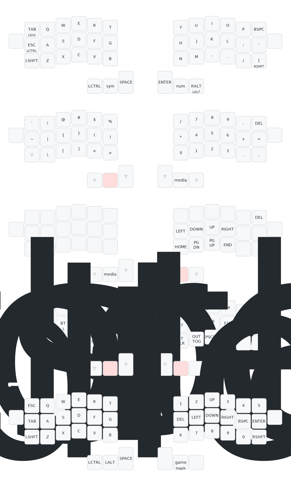

# ZMK Firmware для Jorne (nice!nano v2)

Конфигурация ZMK для беспроводной сплит-клавиатуры Jorne-WL v3.0.1.

- **ZMK**: v0.3.0
- **Board**: nice_nano_v2
- **Shields**: jorne_left, jorne_right
- **ZMK Studio**: включен (USB)

## Сборка

Push в GitHub запускает автоматическую сборку. Скачать прошивку: вкладка **Actions** -> артефакт `firmware`.

## Прошивка

Для каждой половины (сначала правая, потом левая):

1. Подключить по USB
2. Двойной клик RESET (или замкнуть RST + GND) — появится USB-диск
3. Скопировать `.uf2` файл на диск:
   - Правая: `jorne_right-nice_nano_v2-zmk.uf2`
   - Левая: `jorne_left-nice_nano_v2-zmk.uf2`
4. После обеих — однократно нажать Reset на каждой половине

**Сброс Bluetooth** (если не подключается): прошить `settings_reset-nice_nano_v2-zmk.uf2` на обе половины, затем основную прошивку. Удалить старые устройства в настройках BT.

## Раскладка



## Концепция раскладки

Раскладка спроектирована для **двуязычной работы** (русский + английский) и **программирования** на 42 клавишах.

### Проблема русского языка на 42 клавишах

В русском алфавите 33 буквы, а стандартный QWERTY имеет только 26 буквенных позиций. При переключении ОС на русский (ЙЦУКЕН), «лишние» русские буквы занимают позиции знаков препинания:

| Клавиша | Английский | Русский |
|---------|-----------|---------|
| `;`     | точка с запятой | **Ж** |
| `'`     | апостроф | **Э** |
| `[`     | скобка | **Х** |
| `]`     | скобка | **Ъ** |

Буквы **Ж**, **Э** и **Х** — частые, поэтому клавиши `;` `'` `[` обязаны быть на основном слое. **Ъ** и **Ё** используются редко — они вынесены на слой символов (через `]` и `` ` ``).

### Решение: hold-tap на угловых клавишах

На 42 клавишах не хватает места для всех модификаторов и русских букв одновременно. Вместо home-row mods (которые вызывают случайные срабатывания) используются **hold-tap на угловых клавишах** — их нажимают только намеренно:

| Позиция | Тап (короткое нажатие) | Удержание |
|---------|----------------------|-----------|
| Левый home-row edge | TAB | LGUI (Win) |
| Правый нижний угол | `[` (Х в русском) | Right Shift |
| Правый крайний thumb | CAPS (переключение языка) | Left Alt |

Это не home-row mods — угловые клавиши находятся на крайних позициях, куда палец тянется целенаправленно. Ложных срабатываний нет.

### Архитектура слоёв

| Слой | Назначение | Активация |
|------|-----------|-----------|
| L0 (base) | QWERTY / ЙЦУКЕН | по умолчанию |
| L1 (sym) | Символы + numpad-калькулятор | `mo(1)` — левый средний thumb |
| L2 (nav) | Vim-навигация (одной рукой) | `mo(2)` — правый средний thumb |
| L3 (media) | Медиа, BT, F-keys, система | оба layer-ключа одновременно |
| L4 (game) | Игровой слой | toggle из L3 |

L3 реализован через **conditional layer** — ZMK автоматически активирует его, когда зажаты оба `mo(1)` и `mo(2)`. Дополнительно, в L1 на правом среднем thumb и в L2 на левом среднем thumb стоит `mo(3)` — прямой доступ к L3 одним пальцем, без необходимости зажимать оба layer-ключа.

## L0 — Base (QWERTY / ЙЦУКЕН)

```
╭──────────┬─────┬─────┬─────┬─────┬─────╮   ╭─────┬─────┬─────┬─────┬─────┬──────────╮
│   ESC    │  Q  │  W  │  E  │  R  │  T  │   │  Y  │  U  │  I  │  O  │  P  │   BKSP   │
├──────────┼─────┼─────┼─────┼─────┼─────┤   ├─────┼─────┼─────┼─────┼─────┼──────────┤
│ TAB/LGUI │  A  │  S  │  D  │  F  │  G  │   │  H  │  J  │  K  │  L  │  ;  │    '     │
├──────────┼─────┼─────┼─────┼─────┼─────┤   ├─────┼─────┼─────┼─────┼─────┼──────────┤
│  LSHIFT  │  Z  │  X  │  C  │  V  │  B  │   │  N  │  M  │  ,  │  .  │  /  │ [/RSHIFT │
╰──────────┴─────┴─┬───┴─┬───┴─┬───┴─────╯   ╰─────┴───┬─┴───┬─┴─────┴─────┴──────────╯
                   │LCTRL│ SYM │SPACE│           │ENTER│ NUM │CAPS/LALT│
                   ╰─────┴─────┴─────╯           ╰─────┴─────┴─────────╯
```

Русский вид (при переключенной ОС на ЙЦУКЕН):

```
╭──────────┬─────┬─────┬─────┬─────┬─────╮   ╭─────┬─────┬─────┬─────┬─────┬──────────╮
│   ESC    │  Й  │  Ц  │  У  │  К  │  Е  │   │  Н  │  Г  │  Ш  │  Щ  │  З  │   BKSP   │
├──────────┼─────┼─────┼─────┼─────┼─────┤   ├─────┼─────┼─────┼─────┼─────┼──────────┤
│ TAB/WIN  │  Ф  │  Ы  │  В  │  А  │  П  │   │  Р  │  О  │  Л  │  Д  │  Ж  │    Э     │
├──────────┼─────┼─────┼─────┼─────┼─────┤   ├─────┼─────┼─────┼─────┼─────┼──────────┤
│  LSHIFT  │  Я  │  Ч  │  С  │  М  │  И  │   │  Т  │  Ь  │  Б  │  Ю  │  .  │ Х/RSHIFT │
╰──────────┴─────┴─┬───┴─┬───┴─┬───┴─────╯   ╰─────┴───┬─┴───┬─┴─────┴─────┴──────────╯
                   │LCTRL│ SYM │SPACE│           │ENTER│ NUM │ ЯЗ/LALT│
                   ╰─────┴─────┴─────╯           ╰─────┴─────┴────────╯
```

**Почему так:**
- **Space слева, Enter справа** — пробел нажимается чаще, левый большой палец сильнее у правшей. Enter логичен справа — завершает ввод.
- **LCTRL на thumb** — Ctrl+Z/X/C/V выполняются одной левой рукой (thumb + указательный/средний).
- **CAPS на thumb** — переключение языка одним нажатием, без комбинаций. В ОС настроено: Caps Lock = переключение раскладки.
- **Все 31 русская буква на base слое** (без Ё и Ъ) — печатать на русском можно не заходя на другие слои.

## L1 — Символы + Numpad-калькулятор

Активируется **левым средним thumb** (`mo(1)`). Левая рука зажимает слой — правая свободна для набора.

```
╭───────┬─────┬─────┬─────┬─────┬─────╮   ╭──────┬──────┬──────┬───────┬──────┬──────╮
│   `   │  !  │  @  │  #  │  $  │  %  │   │  /   │  7   │  8   │   9   │  -   │ DEL  │
├───────┼─────┼─────┼─────┼─────┼─────┤   ├──────┼──────┼──────┼───────┼──────┼──────┤
│   ~   │  |  │  {  │  }  │  (  │  )  │   │  *   │  4   │  5   │   6   │  +   │  =   │
├───────┼─────┼─────┼─────┼─────┼─────┤   ├──────┼──────┼──────┼───────┼──────┼──────┤
│ SHIFT │  \  │  [  │  ]  │  <  │  >  │   │  0   │  1   │  2   │   3   │  .   │  ,   │
╰───────┴─────┴─┬───┴─┬───┴─┬───┴─────╯   ╰──────┴───┬──┴───┬──┴───────┴──────┴──────╯
                │     │▓▓▓▓▓│     │            │     │ L3   │     │
                ╰─────┴─────┴─────╯            ╰─────┴──────┴─────╯
```

**Почему так:**

- **Левая сторона — символы для программирования:**
  - **Верхний ряд:** `` ` ! @ # $ % `` — Shift+цифра символы. Мышечная память с обычной клавиатуры.
  - **Home row: `| { } ( )`** — скобки на сильных пальцах. `{}` на среднем и безымянном для блоков кода, объектов, функций.
  - **Bottom row: `\ [ ] < >`** — оставшиеся скобки. `<>` рядом — для HTML/JSX и дженериков.
- **Правая сторона — numpad-калькулятор:**
  - **Центр (U-I-O / J-K-L / M-,-.):** 7-8-9 / 4-5-6 / 1-2-3 — стандартная раскладка калькулятора.
  - **Левый столбец (Y/H/N):** `/` `*` `0` — деление, умножение, ноль внизу.
  - **Правый столбец (P/;/.):** `-` `+` `.` — вычитание, сложение, десятичная точка.
  - **Крайний правый:** DEL `=` `,` — удаление, результат, разделитель тысяч.
- **DEL справа вверху** — дополняет BKSP с base слоя.

**Замечание:** слой символов корректно работает только в **английской раскладке** ОС. В русской раскладке коды клавиш транслируются иначе. Это стандартная практика — код пишется в английском режиме.

## L2 — Vim-навигация (одной рукой)

Активируется **правым средним thumb** (`mo(2)`). Навигация выполняется **одной правой рукой** — правый thumb зажимает слой, правые пальцы нажимают стрелки.

```
╭───────┬─────┬─────┬─────┬─────┬─────╮   ╭──────┬──────┬──────┬───────┬──────┬──────╮
│       │     │     │     │     │     │   │      │      │      │       │      │ DEL  │
├───────┼─────┼─────┼─────┼─────┼─────┤   ├──────┼──────┼──────┼───────┼──────┼──────┤
│       │     │     │     │     │     │   │  ←   │  ↓   │  ↑   │   →   │      │      │
├───────┼─────┼─────┼─────┼─────┼─────┤   ├──────┼──────┼──────┼───────┼──────┼──────┤
│       │     │     │     │     │     │   │HOME  │PGDN  │PGUP  │  END  │      │      │
╰───────┴─────┴─┬───┴─┬───┴─┬───┴─────╯   ╰──────┴───┬──┴───┬──┴───────┴──────┴──────╯
                │     │ L3  │     │            │     │▓▓▓▓▓│     │
                ╰─────┴─────┴─────╯            ╰─────┴─────┴─────╯
```

**Почему так:**

- **Home row HJKL: ← ↓ ↑ →** — классическое Vim-расположение. Навигация без отрыва от home row.
- **Bottom row: HOME PGDN PGUP END** — вертикально парные со стрелками (← ↔ HOME, ↓ ↔ PGDN, ↑ ↔ PGUP, → ↔ END).
- **Одноручная навигация** — mo(2) на правом thumb, стрелки на правых пальцах. Левая рука полностью свободна (например, для мыши).
- **Левая сторона пустая** — чистый навигационный слой, без случайных нажатий.
- **DEL справа вверху** — быстрое удаление при навигации.

## L3 — Медиа + Bluetooth + F-keys + Система

Активируется **зажатием обоих layer-ключей** одновременно (L1 + L2). Защита от случайного нажатия — нужно намеренно зажать оба thumb.

```
╭────────┬──────┬──────┬──────┬────────┬────────╮   ╭────────┬─────┬─────┬─────┬───────┬────────╮
│  MUTE  │ PREV │  PP  │ NEXT │ VOL UP │ BRI UP │   │  F1    │ F2  │ F3  │ F4  │  F5   │  F6    │
├────────┼──────┼──────┼──────┼────────┼────────┤   ├────────┼─────┼─────┼─────┼───────┼────────┤
│        │ BT0  │ BT1  │ BT2  │  BT3   │  BT4   │   │  F7    │ F8  │ F9  │ F10 │  F11  │  F12   │
├────────┼──────┼──────┼──────┼────────┼────────┤   ├────────┼─────┼─────┼─────┼───────┼────────┤
│  BOOT  │RESET │ GAME │      │ VOL DN │ BRI DN │   │ BT CLR │ OUT │PSCRN│     │ RESET │  BOOT  │
╰────────┴──────┴──┬───┴──┬───┴──┬─────┴────────╯   ╰────────┴───┬─┴───┬─┴─────┴───────┴────────╯
                   │      │     │      │               │      │     │UNLOCK│
                   ╰──────┴─────┴──────╯               ╰──────┴─────┴──────╯
```

**Почему так:**

- **Conditional layer** — не тратит отдельную клавишу. Медиа и BT используются редко, двойное зажатие — адекватная цена.
- **Левая сторона — медиа и Bluetooth:**
  - **Медиа** на верхнем ряду — MUTE, prev/play-pause/next на удобных позициях.
  - **BT профили на home row** — частое переключение между устройствами на сильных пальцах.
  - **Громкость и яркость вертикально** — VOL UP/DN и BRI UP/DN как слайдеры вверх/вниз.
- **Правая сторона — F-keys и система:**
  - **F1-F6** на верхнем ряду, **F7-F12** на home row — два ряда по 6.
  - **BT CLR, OUT TOG, PSCRN** — системные утилиты на нижнем ряду правой стороны.
  - **GAME** — toggle включения игрового слоя (L4) на нижнем ряду левой стороны.
  - **UNLOCK (studio_unlock)** — на правом thumb. При L3 оба средних thumb заняты, правый крайний свободен.
- **BOOT и RESET** — зеркально в углах обеих сторон для защиты от случайного нажатия.

## L4 — Игровой слой

Специальный слой для игр. Работает как **toggle** — включается один раз и остаётся активным, пока не выключишь. Все hold-tap поведения отключены — каждая клавиша срабатывает мгновенно, без задержек.

### Как включить

1. Зажать **оба layer-ключа** одновременно (левый средний thumb + правый средний thumb) — активируется L3
2. Не отпуская, нажать **GAME** (левая рука, нижний ряд, третья клавиша — позиция X на base слое)
3. Отпустить всё — игровой слой активен, клавиатура в игровом режиме

```
На L3 кнопка GAME здесь:

│  BOOT  │RESET │>>GAME<<│      │ VOL DN │ BRI DN │
```

### Как выключить

Нажать **правый средний thumb** (та же клавиша, что mo(2) на обычных слоях). Клавиатура вернётся в обычный режим.

### Раскладка

```
╭───────┬─────┬─────┬─────┬─────┬─────╮   ╭──────┬──────┬──────┬───────┬──────┬──────╮
│  ESC  │  Q  │  W  │  E  │  R  │  T  │   │  1   │  2   │  ↑   │   3   │  4   │  5   │
├───────┼─────┼─────┼─────┼─────┼─────┤   ├──────┼──────┼──────┼───────┼──────┼──────┤
│  TAB  │  A  │  S  │  D  │  F  │  G  │   │ DEL  │  ←   │  ↓   │   →   │ BSPC │ENTER │
├───────┼─────┼─────┼─────┼─────┼─────┤   ├──────┼──────┼──────┼───────┼──────┼──────┤
│ LSHFT │  Z  │  X  │  C  │  V  │  B  │   │  6   │  7   │  8   │  9    │  0   │RSHFT │
╰───────┴─────┴─┬───┴─┬───┴─┬───┴─────╯   ╰──────┴───┬──┴───┬──┴───────┴──────┴──────╯
                │LCTRL│LALT │SPACE│           │     │ EXIT │     │
                ╰─────┴─────┴─────╯           ╰─────┴──────┴─────╯
```

### Почему так

- **Левая сторона — WASD-зона:**
  - Полностью повторяет стандартную клавиатуру: QWERT / ASDFG / ZXCVB на тех же физических позициях.
  - **Без hold-tap** — TAB это просто TAB (не TAB/GUI), LSHFT это просто LSHFT. Мгновенный отклик.
  - **LCTRL и LALT на thumb** — основные модификаторы для игр (приседание, альтернативное действие).
  - **SPACE** — прыжок.
- **Правая сторона — стрелки + цифры:**
  - **Стрелки крестом** — ↑ над ↓, ← и → по бокам (позиции I / J K L). Для игр со стрелочным управлением.
  - **Цифры 1-5 вверху, 6-0 внизу** — как на обычной клавиатуре, разбиты на два ряда. Легко запомнить.
  - **DEL и BSPC** на home row по бокам от стрелок — удаление при наборе в чате.
  - **ENTER** — подтверждение, открытие чата.
- **EXIT** — правый средний thumb (та же позиция, что mo(2) — легко найти на ощупь).

## ZMK Studio

ZMK Studio позволяет менять раскладку через браузер без перепрошивки.

1. Подключить **левую половину** по USB
2. Открыть https://zmk.studio
3. Разблокировать: зажать **оба layer-ключа** (L1 + L2), затем нажать **UNLOCK** (правый крайний thumb на L3)

## Полезные инструменты

- **[Keymap Drawer](https://keymap-drawer.streamlit.app)** — визуализация раскладки. Загрузить файл `config/jorne.keymap` и получить наглядную схему всех слоёв.
- **[Key Test](https://en.key-test.ru/)** — тестирование клавиш.
- **[Keymap Editor](https://nickcoutsos.github.io/keymap-editor/)** — веб-редактор раскладки (через GitHub).

## Использование с macOS

Раскладка кросс-платформенная, но на macOS есть особенности:

### Модификаторы (Ctrl ↔ Cmd)

На macOS основной модификатор — **Cmd (⌘)**, а не Ctrl. Клавиша LGUI на клавиатуре = Cmd на Mac. Поскольку LCTRL на thumb, а LGUI на hold-tap (TAB/LGUI), для удобства рекомендуется **поменять их местами в настройках macOS**:

**System Settings → Keyboard → Keyboard Shortcuts → Modifier Keys** → для этой клавиатуры: Control (⌃) ↔ Command (⌘)

Это per-keyboard настройка — встроенная клавиатура Mac не затронется.

### Переключение языка (CAPS)

CAPS Lock для переключения языка работает, но требует включения:

**System Settings → Keyboard → Input Sources → Edit → "Use Caps Lock to switch Input Source"**

### HOME / END

На macOS HOME/END перемещают курсор в **начало/конец документа**, а не строки. Для навигации по строке: **Cmd+←/→**. Для поведения как на Windows/Linux: установить [Karabiner-Elements](https://karabiner-elements.pqrs.org/) с правилом "PC-style Home/End".

### Print Screen (PSCRN)

Не работает на macOS. Для скриншотов:
- **Cmd+Shift+3** — весь экран
- **Cmd+Shift+4** — область
- **Cmd+Shift+5** — панель с опциями

### Медиа-клавиши

Громкость, яркость, prev/play/next — **работают без настройки** через HID consumer codes.

## Решение проблем

| Проблема | Причина | Решение |
|----------|---------|---------|
| Клавиатура не видна по BT | Прошита `settings_reset` | Прошить основную прошивку на обе половины |
| Клавиатура не видна по BT | Старое BT-сопряжение на Mac | Удалить устройство и подключиться заново |
| Клавиатура не видна по BT | `CONFIG_ZMK_POINTING=y` без hardware | Убрать эту опцию из jorne.conf |
| Половинки не связываются | Сбой BLE-бондов | settings_reset на обе, затем основная прошивка |
| Keymap не компилируется | Неправильное количество позиций | 44 позиции (не 42), `&none` по краям первого ряда |
| "No board named 'nice_nano_v2'" | ZMK main переименовал board | Использовать ZMK v0.3.0 |

## Ссылки

- [ZMK документация](https://zmk.dev)
- [Jorne ZMK config (joric)](https://github.com/joric/jorne-zmk-config)
- [nice!nano документация](https://nicekeyboards.com/docs/nice-nano/)

## Структура

```
config/
  jorne.conf      # Kconfig (BT, power management, RGB, display)
  jorne.keymap    # Раскладка + behaviors + conditional layers
  west.yml        # Версия ZMK
build.yaml        # Матрица сборки (left+studio, right, settings_reset)
```
